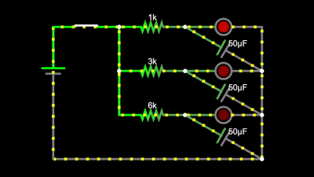

# RC-Timing-Circuit

This is a circuit made in [Falstad](https://falstad.com/circuit/circuitjs.html) where LEDs light up in sequence using RC timing.

Each LED has its own branch with:
 - A resistor (1 kΩ before the top LED, 3 kΩ before the middle, and 6 kΩ before the bottom)
 - A 50μF capacitor

When the switch closes, the different resistor values create different delays that make the LEDs turn on at slightly different times, making a sequential lighting effect.

